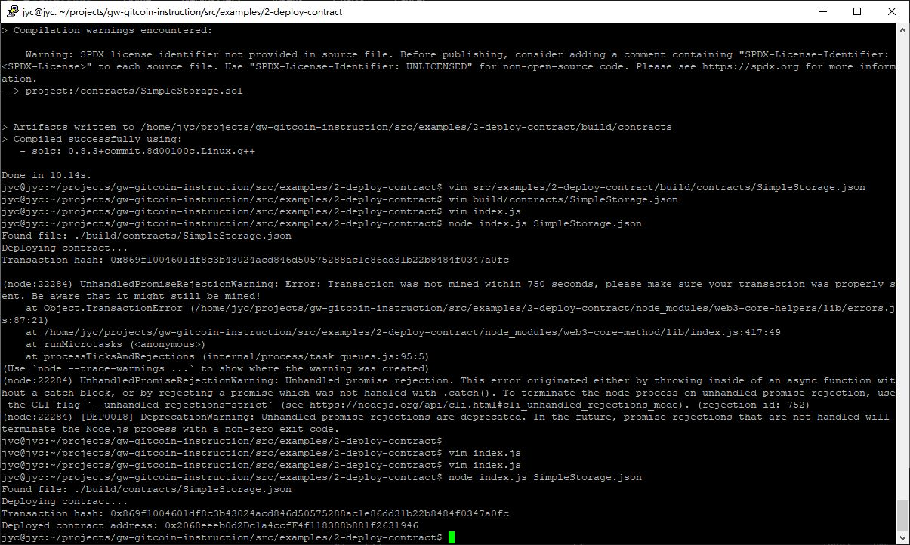

# Task 02
1. A screenshot of the console output immediately after you have successfully deployed a smart contract.
	
2. The transaction hash from the contract deployment (in text format).
	```
	0x869f1004601df8c3b43024acd846d50575288ac1e86dd31b22b8484f0347a0fc
	```
3. The deployed contract address from the contract deployment (in text format).
	```
	0x2068eeeb0d2Dc1a4ccfF4f118388b881f2631946
	```
